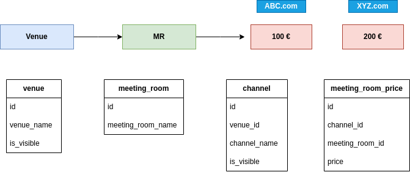

# Meeting Package

## Getting started
Follow bellow steps before getting start
1) Rename `sample-env` as `.env` and reset the parameters 
2) Run `npm install` for install packages
3) Run `npm start` 
4) Run `npm run dev` for the dev testing 

## Database
1) Install mysql
2) Create a database called `meeting_package`
3) Import the sql file `meeting_package.sql`

# Design

## Logged time
1) Clear the requirement and design the project - 2h
2) Design and create database                   - 1h
3) Build the boiler plate                       - 1h
4) Create a RESTful API                         - 2h
5) Documentation                                - 30min